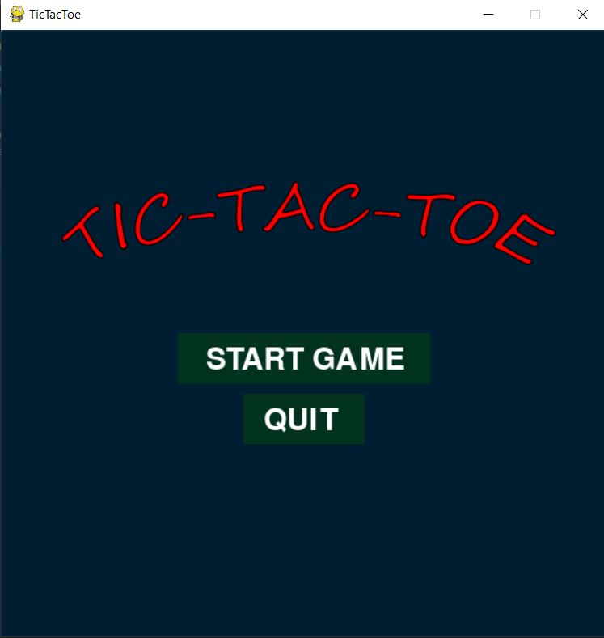
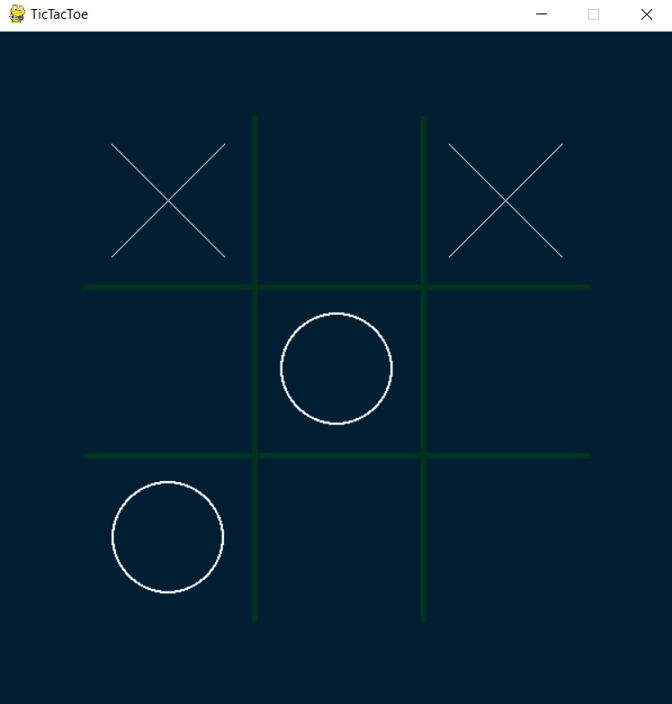
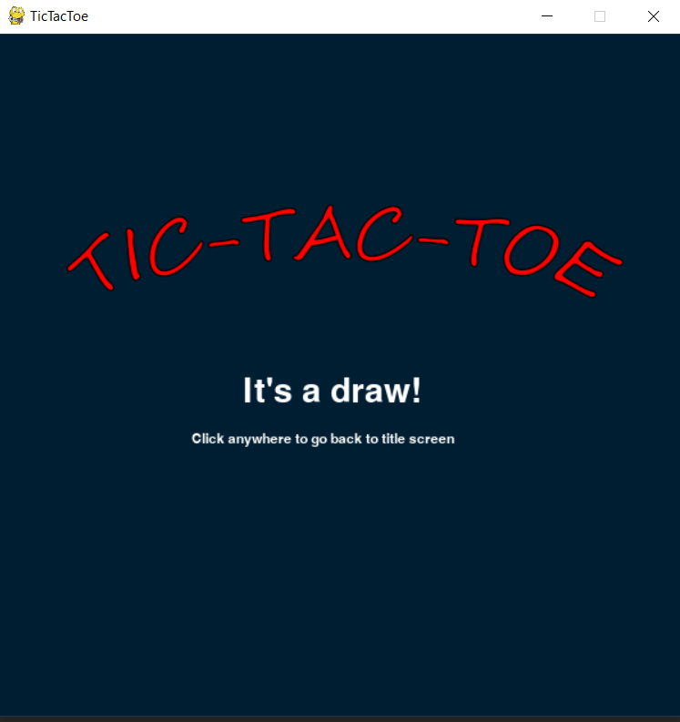
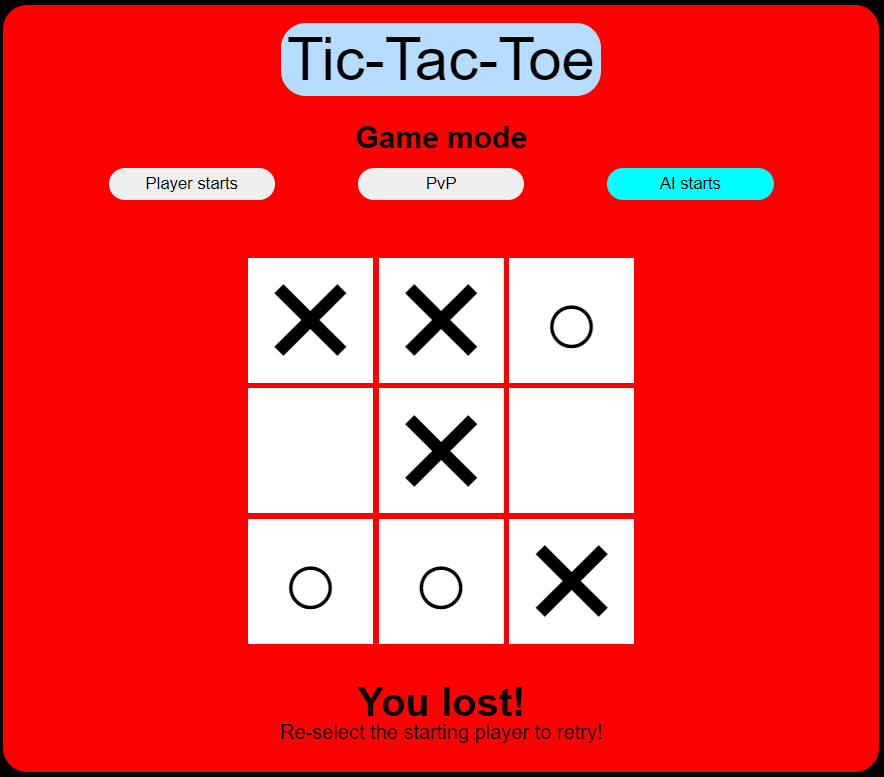
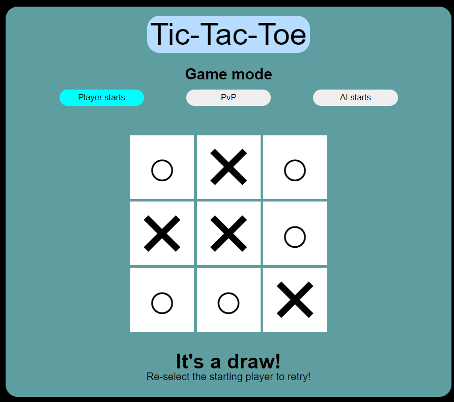
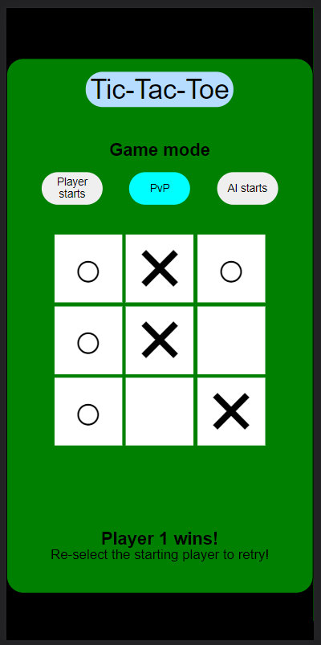

# tictactoe
Classic Tic-Tac-Toe game
<h1>TicTacToe - Python version</h1>  
                <b>
                    <a id="tttrepo" href="https://github.com/jspoh/tictactoe" target="_blank"
                        class="srcCode hlink">Source code</a>   
                    To use this program, copy the code from the link above and paste it in your IDE/Code editor  
                    If you don't have any IDEs or Code editors for python, you will have to install python shell and
                    paste the code in notepad. Change the extension to '.py'
                </b>
                   
                
  
                This program will play the classic tictactoe game with you. It will try its best to win you or at least
                prevent you from winning. The player may use their mouse to click on the box they'd like to select.  
                It is still possible to win against the AI as it will not always choose the center positioning even if
                the player did not select it.
                 
                 
                    
                Game screen on launch    
                    
                This is what gameplay looks like   
                   
                End game screen. It can either be win, lose, or draw. The draw result screen is shown in this case.
                     

150522 update.

<h1>TicTacToe - Javascript version</h1>
                <b>
                    Source code provided in the same github <a href="#tttrepo" class="hlink">repository</a> linked on
                    top
                     
                    You may try out the javascript version of the game <a class="hlink" target="_blank"
                        href="https://jspoh.github.io/projects/games/tictactoe/tictactoe.html">here</a>!
                </b>
                  
                

                  
                I made this javascript version mainly to learn and practice writing and implementing the minimax
                algorithm.
                   
                Although it was super tedious and frustrating trying to write my own code initially, I'm glad I went
                through it as I feel as though I've learnt quite a bit more about recursive functions and AI development
                for games.
                  
                This tictactoe version features:  
                - 3 game modes to choose from 
                - Unbeatable AI. 
                 
                Players may choose to go first, allow the AI to go first, or a PvP gamemode with friends.  
                If the player chooses to go first, the game will always result in a loss/draw but if the AI goes first
                and the player does not select the center box in his/her first turn, the AI will always win.
                   
                
                   
                This is a player losing to the AI in the gamemode which the AI is allowed to go first.
                  
                
                  
                This is a player drawing a game with the AI after going first.
                  
                
                  
                This is a player winning against his friend in PvP mode on mobile.
                 
